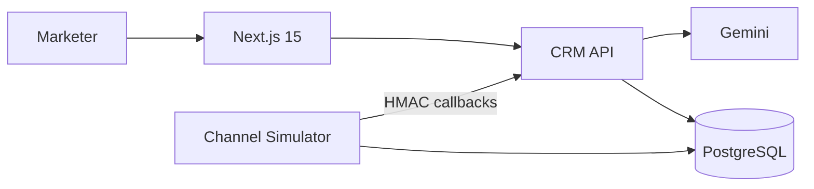

# Xeno Genie

**Tell us your goal. We'll handle the rest.**

Xeno Genie is an AI-native shopper relationship agent for consumer brands. A
marketer states a business goal; Genie discovers a fatigue-safe audience,
recommends strategy, channel and copy, forecasts the outcome, and launches the
campaign through an independent channel simulator.

## What Makes It Different

- Goal-first AI Command Center instead of a campaign form
- Explainable opportunity and communication-fatigue scores
- Automatic audience discovery with high-fatigue suppression
- Gemini-generated strategy and copy, validated against a strict schema
- Separate asynchronous channel service with signed callbacks and retries
- Live shopper profiles, event funnel, ROI, and executive insight feed

## Architecture



Detailed documents:

- [Architecture](docs/ARCHITECTURE.md)
- [Data model and ER diagram](docs/DATA_MODEL.md)
- [API contract](docs/API.md)
- [Implementation plan](docs/IMPLEMENTATION_PLAN.md)

## Stack

- Next.js 15, React 19, TypeScript, Tailwind, React Query, Recharts
- Node.js, Express, Prisma, PostgreSQL
- Gemini structured generation
- Docker Compose locally, Vercel + Render + Supabase for deployment

## Local Setup

Requirements: Node.js 20+, npm, and Docker Desktop.

```bash
npm install
docker compose up -d postgres
npm run db:generate
npm run db:push
npm run db:seed
npm run dev
```

Open:

- Product: `http://localhost:3000`
- CRM API health: `http://localhost:4000/api/v1/health`
- Simulator health: `http://localhost:4001/health`

Local environment files have development-safe defaults. Add the Gemini key to
`apps/api/.env`:

```env
GEMINI_API_KEY="your-key"
```

Without a key, Genie uses a labeled deterministic fallback so the full demo
still works.

## Demo Walkthrough

1. Open the Command Center.
2. Enter `Bring back inactive shoppers without increasing fatigue`.
3. Review the audience, protected shoppers, channel evidence, copy, and forecast.
4. Approve and launch.
5. Open Campaigns or Analytics and watch callback events update the funnel.
6. Open a shopper profile to inspect orders, touchpoints, and score explanations.

## Commands

| Command | Purpose |
| --- | --- |
| `npm run dev` | Start web, API, and simulator |
| `npm run build` | Create production artifacts |
| `npm run typecheck` | Strict type check all workspaces |
| `npm run test` | Run scoring tests |
| `npm run db:push` | Apply schema without migrations |
| `npm run db:seed` | Generate the deterministic demo dataset |
| `npm run db:studio` | Inspect PostgreSQL through Prisma Studio |

## Demo Data

The deterministic seed creates:

- 500 shopper profiles across active, dormant, at-risk, and fatigue cohorts
- 5,000 orders with realistic products, values, sources, and statuses
- 100 historical campaigns
- Approximately 3,500 communications plus lifecycle events
- Executive insights and reusable system segments

## Reliability

- PostgreSQL durable queue using row leases and `FOR UPDATE SKIP LOCKED`
- Unique event idempotency keys
- HMAC SHA-256 callback signatures with timestamp tolerance
- Exponential callback retry
- Simulated provider failures and lease release
- Zod validation at external boundaries
- Audit logs for AI plans, approvals, launches, and seed actions

## Deployment

### Supabase

1. Create a PostgreSQL project.
2. Use the pooled URL for `DATABASE_URL` and direct URL for `DIRECT_URL`.
3. Run `npm run db:generate`, `npm run db:push`, and `npm run db:seed`.

### Render

The included `render.yaml` defines the CRM web service and independent channel
worker. Configure matching `CRM_SERVICE_TOKEN` and `CALLBACK_SECRET` values on
both services. Set `CRM_INTERNAL_URL` to the public CRM URL plus `/api/v1`.

### Vercel

Set the root directory to `apps/web`, use the Next.js preset, and configure:

```env
NEXT_PUBLIC_API_URL="https://your-api.onrender.com/api/v1"
```

Set `WEB_ORIGIN` on Render to the final Vercel origin.

