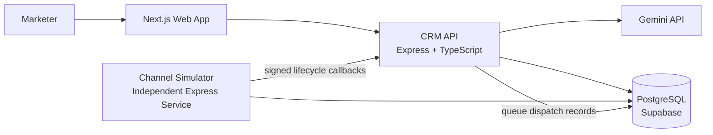

# Xeno Genie Architecture

## Product Boundary

Xeno Genie is a single-brand, AI-native shopper relationship agent. The primary
workflow is goal-first rather than campaign-first:

1. A marketer describes a business outcome.
2. Gemini turns the goal and current business context into a structured plan.
3. Xeno Genie ranks shoppers by opportunity and fatigue.
4. The marketer reviews the audience, reasoning, channel, message, and forecast.
5. Approval creates a campaign and queues communications.
6. A separate channel simulator processes sends and posts lifecycle callbacks.
7. Campaign analytics and executive insights update from those events.

The assessment build is single-tenant, but core records include `brandId` so a
future authentication and tenancy layer does not require redesigning the data.

## System Context



## Monorepo

```text
apps/
  web/                  Next.js application and product UI
  api/                  CRM HTTP API and callback receiver
  channel-simulator/    independent asynchronous delivery service
packages/
  database/             Prisma schema, migrations, and deterministic seed
  shared/               contracts, validation, scoring, and constants
docs/                   architecture, API, data model, and deployment notes
```

## Runtime Responsibilities

### Web

- Goal-first AI Command Center
- Dashboard and executive insight feed
- Shopper intelligence and explainable scores
- Campaign review, launch, and progress
- Analytics with event and channel filtering
- React Query for server state and Recharts for visualization

### CRM API

- Business metrics and shopper queries
- Fatigue and opportunity scoring
- Gemini prompt orchestration and structured response validation
- Segment preview and campaign materialization
- Communication queue creation
- Signed, idempotent simulator callback ingestion
- Analytics aggregation and audit logging

### Channel Simulator

- Polls queued communications from PostgreSQL
- Simulates channel-specific delivery outcomes and delays
- Posts signed `SENT`, `DELIVERED`, `FAILED`, `OPENED`, `READ`, `CLICKED`,
  and `PURCHASED` callbacks
- Retries callbacks with exponential backoff
- Persists attempts and terminal failures for inspection

The simulator is a separate deployable process and does not call a real
messaging provider.

## Durable Queue

`communications` acts as the durable dispatch queue. Workers claim rows with a
short lease in a transaction. In production PostgreSQL, the claim query uses
`FOR UPDATE SKIP LOCKED`, allowing multiple simulator replicas without duplicate
work.

Each lifecycle callback contains:

- `eventId`: globally unique idempotency key
- `communicationId`
- `campaignId`
- `type`
- `occurredAt`
- optional metadata such as simulated revenue

The CRM API stores callbacks in `communication_events` with a unique `eventId`.
Repeated callbacks return success without applying metrics twice.

## Scoring Engines

Both engines are deterministic and explainable. Gemini may narrate results but
does not calculate the scores.

### Opportunity Score

Normalized weighted score:

| Signal | Weight |
| --- | ---: |
| Purchase recency | 25% |
| Purchase frequency | 20% |
| Monetary value | 20% |
| Engagement rate | 15% |
| Historical conversion rate | 15% |
| Preferred-channel fit | 5% |

Scores are clamped to 0-100. The API returns the strongest positive and negative
contributors alongside each score.

### Fatigue Score

Normalized weighted score:

| Signal | Weight |
| --- | ---: |
| Messages received in 7 days | 30% |
| Messages received in 30 days | 20% |
| Ignore rate | 20% |
| Consecutive non-engagement | 15% |
| Recent failed sends | 10% |
| Low purchase cadence mismatch | 5% |

Fatigue policy:

- `0-39`: eligible
- `40-69`: reduce frequency
- `70-84`: suppress for 7 days
- `85-100`: suppress for 14 days

Campaign audience selection excludes suppressed customers by default and states
how many people were protected.

## Gemini Workflow

The API sends Gemini a compact aggregate business context, never the complete
customer dataset. The model returns JSON validated against a strict schema:

- interpreted goal
- audience rule and explanation
- strategy and explanation
- recommended channel and evidence
- message copy
- expected open, click, conversion, and revenue ranges
- follow-up recommendation

The backend applies the returned audience rule to local data and recalculates
forecast counts. When Gemini is unavailable, a deterministic strategy engine
keeps the demo functional and labels the source as `FALLBACK`.

## Security and Reliability

- Zod validation at HTTP boundaries
- HMAC SHA-256 callback signatures and timestamp tolerance
- Idempotent lifecycle event ingestion
- Retry with exponential backoff and capped attempts
- Structured request and worker logs
- Audit records for AI plans, approvals, launches, and callback failures
- Environment secrets kept server-side
- Rate limiting and restrictive CORS in production
- Graceful shutdown for API and worker processes

## Deployment

- Web: Vercel
- CRM API: Render web service
- Channel simulator: Render background worker or private web service
- PostgreSQL: Supabase

The same Prisma schema is used locally through Docker Compose and in Supabase.

