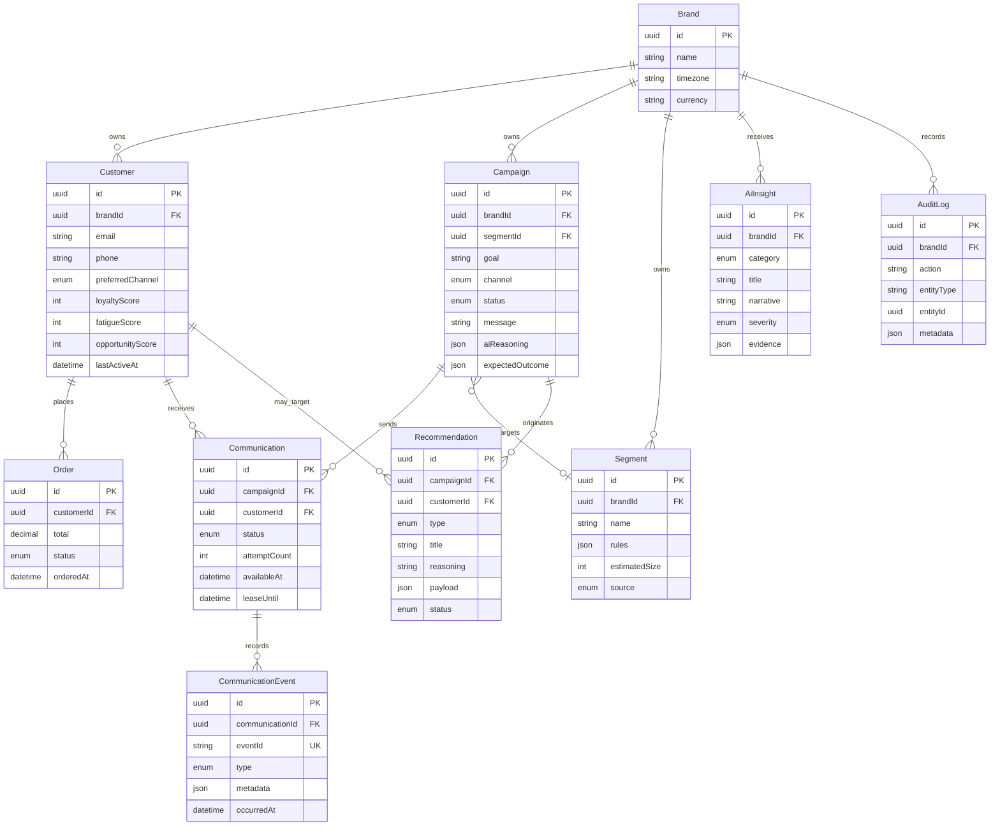

# Data Model

```mermaid
erDiagram
    Brand ||--o{ Customer : owns
    Brand ||--o{ Campaign : owns
    Brand ||--o{ Segment : owns
    Brand ||--o{ AiInsight : receives
    Customer ||--o{ Order : places
    Customer ||--o{ Communication : receives
    Campaign ||--o{ Communication : sends
    Campaign }o--o| Segment : targets
    Communication ||--o{ CommunicationEvent : records
    Campaign ||--o{ Recommendation : originates
    Customer ||--o{ Recommendation : may_target
    Brand ||--o{ AuditLog : records

    Brand {
      uuid id PK
      string name
      string timezone
      string currency
    }
    Customer {
      uuid id PK
      uuid brandId FK
      string email
      string phone
      enum preferredChannel
      int loyaltyScore
      int fatigueScore
      int opportunityScore
      datetime lastActiveAt
    }
    Order {
      uuid id PK
      uuid customerId FK
      decimal total
      enum status
      datetime orderedAt
    }
    Segment {
      uuid id PK
      uuid brandId FK
      string name
      json rules
      int estimatedSize
      enum source
    }
    Campaign {
      uuid id PK
      uuid brandId FK
      uuid segmentId FK
      string goal
      enum channel
      enum status
      string message
      json aiReasoning
      json expectedOutcome
    }
    Communication {
      uuid id PK
      uuid campaignId FK
      uuid customerId FK
      enum status
      int attemptCount
      datetime availableAt
      datetime leaseUntil
    }
    CommunicationEvent {
      uuid id PK
      uuid communicationId FK
      string eventId UK
      enum type
      json metadata
      datetime occurredAt
    }
    AiInsight {
      uuid id PK
      uuid brandId FK
      enum category
      string title
      string narrative
      enum severity
      json evidence
    }
    Recommendation {
      uuid id PK
      uuid campaignId FK
      uuid customerId FK
      enum type
      string title
      string reasoning
      json payload
      enum status
    }
    AuditLog {
      uuid id PK
      uuid brandId FK
      string action
      string entityType
      uuid entityId
      json metadata
    }
```

Computed scores are materialized on `customers` for fast product queries and
can be recomputed from orders and communication events by a scheduled job.

